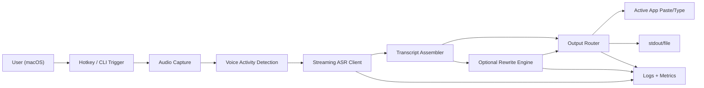

# Architecture: macOS Voice Dictation CLI

## 1) Goal
Build a **macOS-only** CLI app that delivers low-latency dictation and optional rewrite/cleanup, inspired by Wispr Flow / WhisperFlow.

The app should:
- Capture speech with push-to-talk or auto-stop.
- Stream partial text quickly, then finalize transcript.
- Optionally rewrite text (clarity, grammar, tone presets).
- Insert output into the active app or print to stdout.

The app should not (MVP):
- Support Windows/Linux.
- Store long-term cloud user profiles.
- Provide a full GUI beyond minimal setup helpers.

## 2) System Overview


## 3) Core Components
| Component | Responsibility | Suggested Implementation |
|---|---|---|
| `cli` | Entry points (`record`, `dictate`, `rewrite`, `doctor`) | `typer` or `argparse` |
| `audio.capture` | Read mic frames with stable buffering | `sounddevice` or `pyaudio` |
| `audio.vad` | Start/stop speech segments and silence timeout | `webrtcvad` + tunable thresholds |
| `asr.client` | Send audio to transcription backend and receive partial/final text | OpenAI streaming transcription client |
| `text.rewrite` | Optional post-processing prompts (clean, concise, formal) | Chat/Responses API wrapper |
| `output.router` | Route text to stdout, clipboard, or active app injection | `pyperclip`, AppleScript, CGEvent fallback |
| `hotkey.listener` | Push-to-talk global key handling | `pynput`/Quartz event tap (macOS) |
| `config` | Load `.env` + user config with validation | `pydantic-settings` |
| `telemetry` | Structured logs, timing, error codes | `logging` + JSON formatter |
| `doctor` | Validate permissions/config/runtime dependencies | CLI health checks |

## 4) Data Flow (Request Lifecycle)
1. User runs `flow-dictate dictate --ptt` and holds the hotkey.
2. `audio.capture` streams PCM frames into a ring buffer.
3. `audio.vad` decides segment boundaries (speech start/end).
4. `asr.client` streams frames and emits partial text.
5. `transcript assembler` merges partials and final segments.
6. Optional: `text.rewrite` transforms final transcript.
7. `output.router` writes to configured target (`stdout`, clipboard, active app).
8. Telemetry records latency, retries, and any errors.

## 5) Permissions (macOS)
| Permission | Why Needed | Trigger Point | Fallback if Denied |
|---|---|---|---|
| Microphone | Capture speech input | First record attempt | Fail fast with `doctor` guidance |
| Accessibility | Paste/type into active app via automation | First `--output active-app` use | Use clipboard-only mode |
| Input Monitoring (if event tap is used) | Global push-to-talk key capture | First global hotkey setup | Allow manual CLI start/stop |

Notes:
- Ask only when required by the selected mode.
- `doctor` should explain exactly how to enable each permission in System Settings.

## 6) Failure Modes and Handling
| Failure Mode | Symptoms | Mitigation |
|---|---|---|
| Mic unavailable / wrong device | No audio frames, empty transcript | Device listing + explicit `--input-device`; clear error code |
| Network interruption | Partial transcript stalls | Retry with backoff; preserve local buffer; user-visible status |
| ASR timeout / API failure | Final text never arrives | Timeout + graceful cancel + transcript partial recovery |
| Permission denied | No recording or app insertion | Preflight checks in `doctor`; actionable remediation |
| High latency | Delayed text output | Chunked streaming, lower frame size, disable rewrite for real-time mode |
| Duplicate or missing segments | Broken final transcript | Segment IDs + deterministic merge logic + regression tests |
| Active app injection fails | Text not inserted | Clipboard fallback + explicit warning |

## 7) Configuration and Secrets
- Required env var: `OPENAI_API_KEY`.
- Optional config file: `~/.config/flow-dictate/config.toml`.
- Keep secrets in env only; never commit keys.
- Add `flow-dictate doctor` to validate config before use.

## 8) Example CLI (Planned)
```bash
# Setup (uv)
uv venv
uv sync

# Health checks
uv run flow-dictate doctor

# Push-to-talk dictation to stdout
uv run flow-dictate dictate --ptt --output stdout

# Dictate then rewrite for clarity and copy to clipboard
uv run flow-dictate dictate --rewrite clarity --output clipboard

# Dictate and inject into active app (requires accessibility permission)
uv run flow-dictate dictate --output active-app
```

## 9) Architecture Decisions (MVP)
- Prioritize **streaming transcript speed** over aggressive rewrite quality.
- Keep output paths explicit (`stdout`, `clipboard`, `active-app`) to reduce hidden behavior.
- Keep ASR and rewrite as separate modules so either can be swapped independently.
- Maintain a strict error code catalog for support and debugging.
